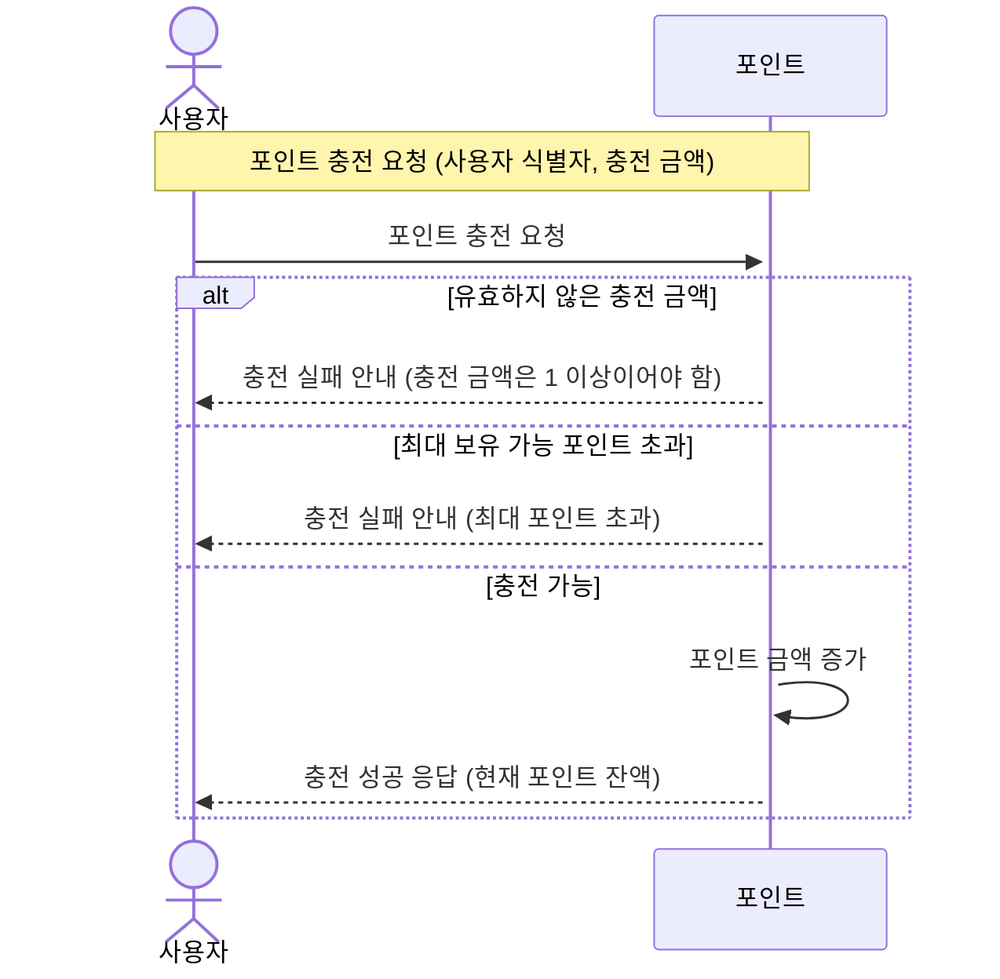
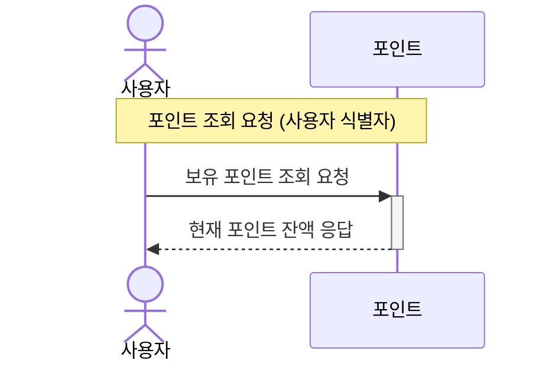

### 1️⃣ 잔액 충전 / 조회 API

- 결제에 사용될 금액을 충전 / 조회 하는 API 를 작성합니다. 
  - `사용자 식별자` 및 `충전할 금액`을 받아 잔액을 충전합니다.
  - `사용자 식별자`를 통해 해당 사용자의 잔액을 조회합니다.
- 고려 사항
  - 잔액 충전/ 조회는 `회원`만 가능합니다.
  - 최소 충전 포인트는 1 이상입니다.
### 1. 잔액 충전

### 2. 잔액 조회
