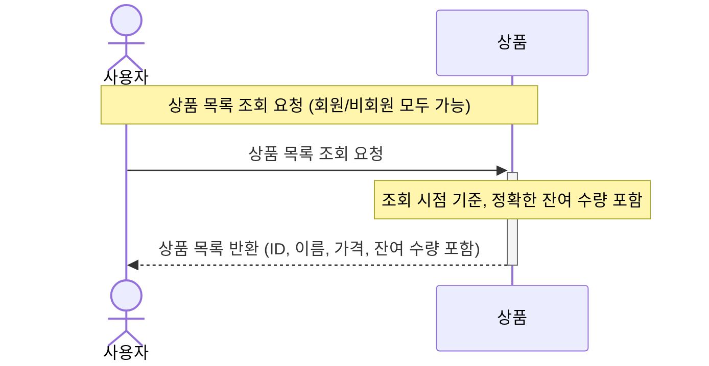

### 2️⃣ **상품 조회 API**

- 상품 정보를 조회 하는 API 를 작성합니다.
  -  `ID`, `이름`, `가격`, `잔여수량` 
- 고려 사항
    - **조회시점의 상품별 잔여수량이 정확해야 합니다.**
    - 상품조회는 `비회원`/`회원` 모두 가능합니다.
    - 상품의 가격, 수량은 변동이 심하다고 가정합니다.
    - 상품의 그룹, 카테고리는 없다고 가정합니다.
    - `비회원`/`회원` 모두 상품 상세 조회에서 수량 선택 후 `장바구니`에 추가할 수 있습니다.
    - 상품 상세 조회에서 수량 선택 후 `바로 구매`가 가능합니다. 단, 구매는 `회원`만 가능합니다.

