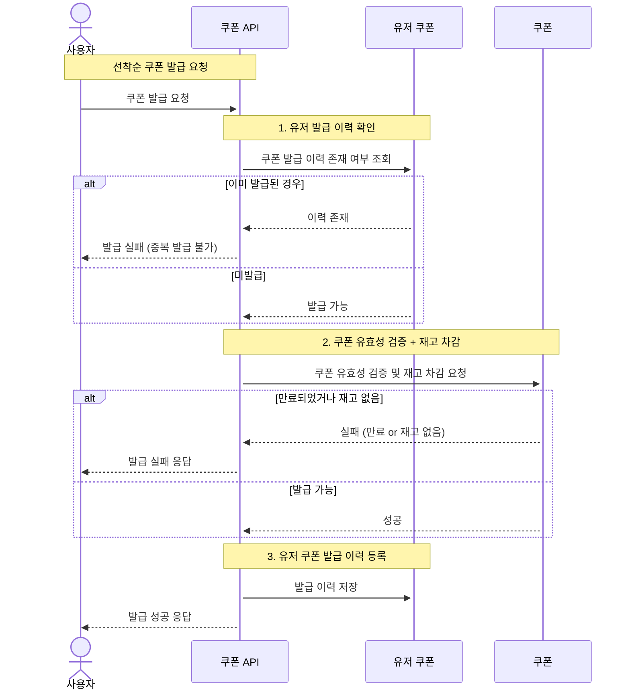

### 3️⃣**선착순 쿠폰 발급 / 보유 쿠폰 목록 조회 API**

- 선착순 쿠폰 발급, 보유 쿠폰 목록을 상세 조회하는 API 를 작성합니다.
    - 사용자는 **선착순**으로 할인 쿠폰을 발급받을 수 있습니다.
    - `주문` 시에 유효한 할인 쿠폰을 함께 제출하면, 전체 주문금액에 대해 할인 혜택을 부여 받을 수 있습니다.
- 고려 사항
    - 선착순 쿠폰 발급 기능은 `회원`만 가능합니다.
    - 보유 쿠폰 목록 조회는 `회원`만 가능합니다.
    - 쿠폰 마다 **최대 발급 가능 갯수**가 정해져있습니다.
    - 쿠폰의 할인 방식은 `정률할인`, `수량 별 정액할인`, `정액할인이` 있습니다.
        - `정률할인`: 총 구매 금액에서 정해진 비율만큼 할인율을 적용하는 방식입니다.
        - `수량 별 정액할인`: 고객이 구매하는 수량 마다 할인액을 적용하는 방식입니다.
        - `정액할인`: 총 구매 금액에서 설정한 할인 금액 만큼 차감하는 방식입니다.
        - [쿠팡 게시글을 참고](https://marketplace.coupangcorp.com/s/blog/sales-news-20210709-MC2WAHAP5EURB4JDFL7YHDATRDNA) 하여 할인 방식을 선정하였습니다.
    - 쿠폰 마다 **최대 할인 금액**이 존재합니다.
    - 쿠폰의 유효 기간은 **유효 날짜가 지정되는 방식**과 **발급 후 및일 이내까지 유효한 방식**으로 나누어져 있습니다.
        - Ex. 유효 날짜가 지정되는 방식 :  `~ 2025년 3월 17일까지`
        - Ex. 발급 후 및일 이내까지 유효한 방식 :  `발급 후 10일동안 유효`
    - **동일한 회원에 대해 중복 쿠폰 발급은 되지 않습니다.** 
      - 선착순 쿠폰은 1인 1매를 원칙으로 합니다.
### 1. 선착순 쿠폰 발급

### 2. 보유 쿠폰 목록 조회
