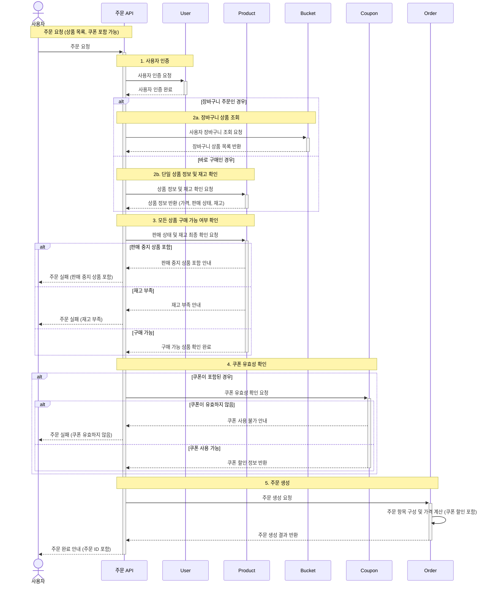
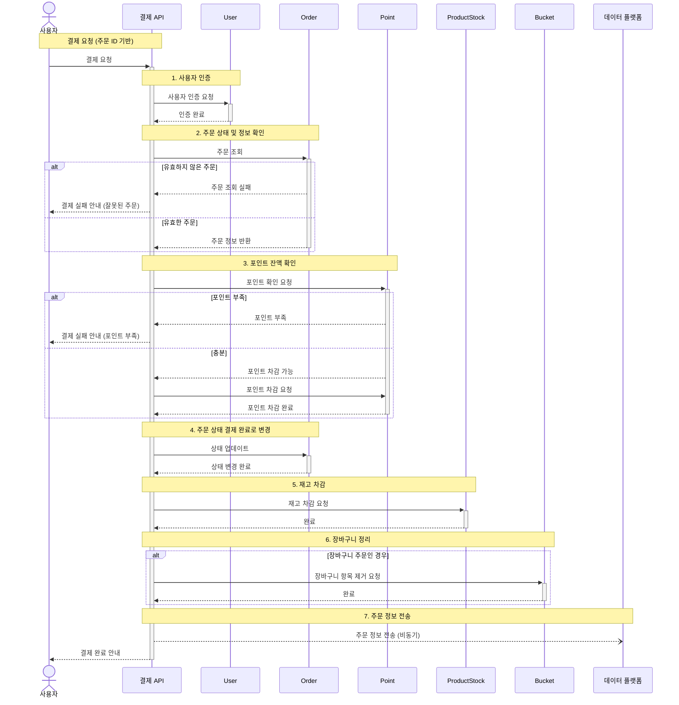

### 4️⃣ **주문 / 결제 API**

- `사용자 식별자`와 `(상품 ID, 수량) 목록` 을 입력받아 주문하고 결제를 수행하는 API 를 작성합니다.
    - `결제`는 기 충전된 잔액을 기반으로 수행하며, 성공 시 보유 잔액을 차감합니다.
    - `데이터 분석` 을 위해 결제 성공 시에 실시간으로 주문 정보를 데이터 플랫폼에 전송합니다.
        - 데이터 플랫폼은 애플리케이션 `외부` 라고 가정하여 작업합니다.
- 고려 사항
    - 주문 / 결제 기능은 `회원`만 가능합니다.
    - `주문`방식은 여러가지 방법이 존재합니다.
      - 상품 상세 페이지에서 수량 선택 후 바로 주문하는 방법.
      - 장바구니에서 여러 상품을 주문하는 방법.
    - **주문 시점** 기준의 판매 상태, 가격, 재고 정보로 주문이 이루어집니다.
        - 주문 시점에 판매 상태가 판매 중이 아닌 경우 주문할 수 없습니다.
        - 주문 시점의 가격으로 주문 금액이 계산됩니다.
        - 주문 시점의 재고가 사용자가 요청한 수량보다 적으면 주문할 수 없습니다.
    - `쿠폰`으로 할인된 경우, 할인 금액만큼 포인트를 차감하도록 합니다.
    - 이미 충전된 포인트로 결제 하며, 부족한 경우 결제할 수 없습니다. 포인트 충전 이후 다시 결제를 시도할 수 있으며 **그 동안 가격/재고가 변경 되더라도 영향을 받지 않습니다.**
  -  `데이터 분석`을 위한 추가 작업 예정 : 결제 성공시 주문 정보를 데이터 플랫폼에 전송하며, 전송 실패 시 어떻게 처리할지 추후에 결정하도록 합니다.
### 1. 주문

### 2. 결제
