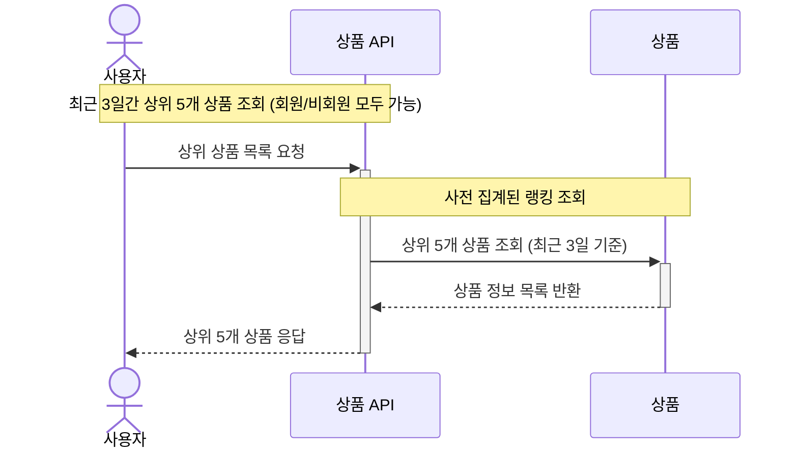

### 5️⃣상위 상품 조회 API

- 최근 3일간 가장 많이 팔린 상위 5개 상품 정보를 제공하는 API 를 작성합니다.
- 고려 사항
    - 상위 상품 조회는 `비회원`/`회원` 모두 가능합니다.
    - 최근 3일이란 정각(00시 00분)을 기준으로 합니다.
        - ex: 2025년 1월 4일에 집계하는 상위 상품은 2025년 1월 1일 00시 00분부터 2025년 1월 4분 00시 00분까지의 판매 결과를 집계한다.
    - 매일 00시 00분에 `스케줄러`를 통해 상위 상품을 집계합니다.
