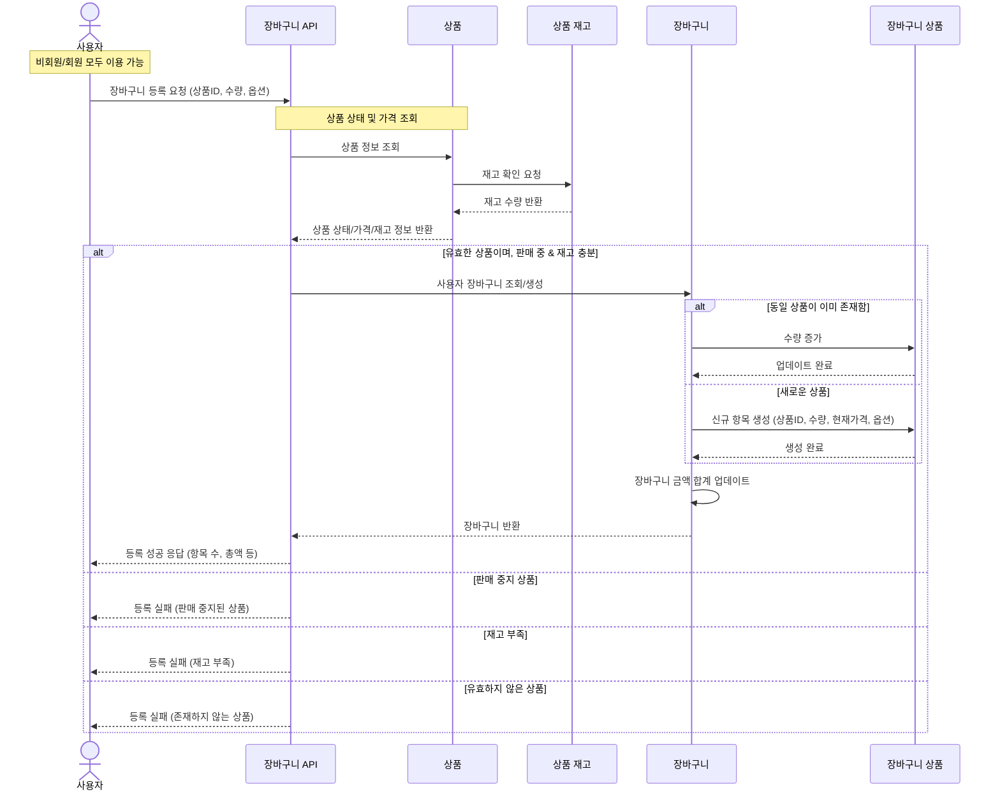

### 6️⃣ 장바구니 조회/등록 API

- 관심 상품을 장바구니에 등록하는 API를 작성합니다.
    - 상품 상세 페이지에서 판매 중이며, 재고가 충분하다면 장바구니에 등록할 수 있습니다.
- 고려 사항
    - 장바구니 API는 `비회원`/`회원` 모두 이용할 수 있습니다.
    - 장바구니에서 제품의 수량 변경시 보유 재고이하로 설정해야합니다.
    - 장바구니에 등록한 제품의 판매 상태, 가격, 재고는 언제든지 변경될 수 있습니다.
    - 장바구니에 등록한 상품들 중 유효한 판매 상태, 재고를 가진 상품들만 주문할 수 있습니다.

### 장바구니 조회
